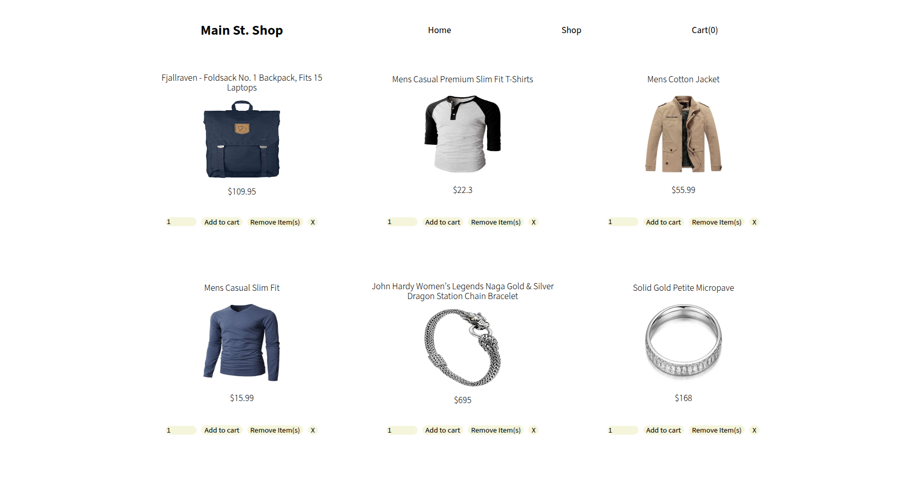

# shopping-cart

## Odin Project React Course Final Project

## Table of Contents
* [Project Overview](#project-overview)
* [Live Demo](#live-demo)
* [Features](#features)
* [Tech Stack](#tech-stack)
* [Setup and Installation](#setup-and-installation)
* [Testing](#testing)
* [What I Learned](#what-i-learned)
* [Future Enhancements](#future-enhancements)
* [License](#license)

## Project Overview

## Live Demo


[demo link](https://mizakson-shopping-cart.netlify.app/)

## Features

## Tech Stack
* __React__: A JavaScript library for building user interfaces.

* __React Router__ DOM: For declarative routing within the application.

* __Vitest__: A blazing fast unit test framework powered by Vite.

* __React Testing Library__: For effective and user-centric component testing.

* __Prop-Types__: For runtime type checking for React props.

* [__FakeStore API__](https://fakestoreapi.com/): Used to fetch product data.

* __CSS__: For styling and layout.

## Setup and Installation

To get this project up and running on your local machine, follow these steps:

1. Clone the repository:

``` bash
git clone https://github.com/Mizakson/shopping-cart
cd shopping-cart
```


2. Install dependencies:
``` bash 
npm install
# or
yarn install
```


3. Start the development server:

```bash 
npm run dev
# or
yarn dev
```

The application will typically open in your browser at `http://localhost:5173` (or a similar port).

## Testing
The application includes extensive and thorough unit tests for each component developed using Vitest and React Testing Library. These tests ensure individual component functionality, user interactions, and integration points behave as expected, contributing to a robust and reliable codebase.

To run the tests, go to your terminal in the project directory and run the following command: 


``` bash

npm test
# or
yarn test

```

## What I Learned
During the development of this project, I gained practical experience and deepened my understanding of several core React and web development concepts, including:

* React Router:
    * Implementing client-side conditional routing using `Outlet` and `Link` components.
    * Configuring application routes with `createBrowserRouter` and `RouterProvider`.
    * Utilizing `useOutletContext` to effectively access states and props from parent components.

* Component-Based Architecture: Designing and structuring an application using reusable React components.

* State Management: Managing application state, particularly for the shopping cart, product quantities, and loading/error states.

* API Integration: Fetching and displaying data from external APIs.

* Testing with React Testing Library and Vitest: Writing comprehensive tests for React components.

* Prop Validation: Enforcing prop types for better component reliability.

## Future Enhancements
* Implement full checkout process and payment integration.

* Add persistent cart storage (back-end).

* Implement a dedicated cart view page with item removal and quantity adjustment.

* Add user authentication and order history.

## License
This project is licensed under the MIT License. See the `LICENSE` file for details.

